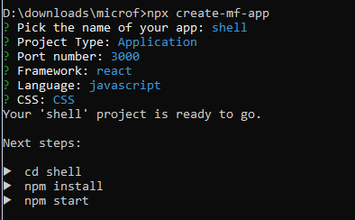
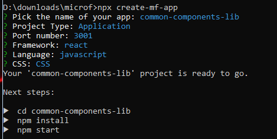

# microfrontend-react-sample
create-mf-app

Once create-mf-app is installed, it will ask for the following info.



Let's create another micro app with name 'common-components-lib'
We will follow same step as above but just different port and name.



Now you need to move inside each app and enter below command to build and run the app.

````
npm install && npm start
````

### Creating Components inside micro app
Now let's add one Header and Footer Component inside the common-components-lib app.

Create a Header Component and paste below code.

````
import React from 'react';
import './header.css';

function Header() {
  return (
    <div class="header">
      <a href="#default" class="logo">
        Header Component
      </a>
      <div class="header-right">
        <a class="active" href="#home">
          Home
        </a>
        <a href="#contact">Contact</a>
        <a href="#about">About</a>
      </div>
    </div>
  );
}

export default Header;
````

Also add one header.css file for styling the component.

````
.header {
    overflow: hidden;
    background-color: #f1f1f1;
    padding: 20px 10px;
}

.header a {
    float: left;
    color: black;
    text-align: center;
    padding: 12px;
    text-decoration: none;
    font-size: 18px;
    line-height: 25px;
    border-radius: 4px;
}

.header a.logo {
    font-size: 25px;
    font-weight: bold;
}

.header a:hover {
    background-color: #ddd;
    color: black;
}

.header a.active {
    background-color: dodgerblue;
    color: white;
}

.header-right {
    float: right;
}

@media screen and (max-width: 500px) {
    .header a {
        float: none;
        display: block;
        text-align: left;
    }

    .header-right {
        float: none;
    }
}
````

Add Footer Component and header.css

````
import React from 'react';
import './footer.css';

function Footer() {
  return (
    <div class="footer">
      <p>Footer Component</p>
    </div>
  );
}

export default Footer;
````

add footer.css

````
.footer {
    position: fixed;
    left: 0;
    bottom: 0;
    width: 100%;
    background-color: #f1f1f1;
    color: black;
    text-align: center;
}
````

Import Header and Footer Component in App Component.

````
import React from 'react';
import ReactDOM from 'react-dom';
import Footer from './Footer';
import Header from './Header';

import './index.css';

const App = () => (
  <>
    <Header />
    <Footer />
  </>
);
ReactDOM.render(<App />, document.getElementById('app'));
````

### Exposing Components to remotes

Now lets expose these two components so that we can use it in Shell app.

Open webpack.config.js of common-components-lib and update code inside plugin like this:

````
new ModuleFederationPlugin({
      name: 'common_components_lib',
      filename: 'remoteEntry.js',
      remotes: {},
      exposes: {
        './Header': './src/Header.jsx',
        './Footer': './src/Footer.jsx',
      },
      shared: {
        ...deps,
        react: {
          singleton: true,
          requiredVersion: deps.react,
        },
        'react-dom': {
          singleton: true,
          requiredVersion: deps['react-dom'],
        },
      },
    }),
````
Note: We updated only "exposes".

### Consume components in Shell app.

Now open webpack.config.js of Shell app and update code inside plugin.

````
const HtmlWebPackPlugin = require('html-webpack-plugin');
const ModuleFederationPlugin = require('webpack/lib/container/ModuleFederationPlugin');

const deps = require('./package.json').dependencies;
module.exports = {
  output: {
    publicPath: 'http://localhost:3000/',
  },

  resolve: {
    extensions: ['.tsx', '.ts', '.jsx', '.js', '.json'],
  },

  devServer: {
    port: 3000,
    historyApiFallback: true,
  },

  module: {
    rules: [
      {
        test: /\.m?js/,
        type: 'javascript/auto',
        resolve: {
          fullySpecified: false,
        },
      },
      {
        test: /\.(css|s[ac]ss)$/i,
        use: ['style-loader', 'css-loader', 'postcss-loader'],
      },
      {
        test: /\.(ts|tsx|js|jsx)$/,
        exclude: /node_modules/,
        use: {
          loader: 'babel-loader',
        },
      },
    ],
  },

  plugins: [
    new ModuleFederationPlugin({
      name: 'shell',
      filename: 'remoteEntry.js',
      remotes: {
        common_components_lib:
          'common_components_lib@http://localhost:3001/remoteEntry.js',
      },
      exposes: {},
      shared: {
        ...deps,
        react: {
          singleton: true,
          requiredVersion: deps.react,
        },
        'react-dom': {
          singleton: true,
          requiredVersion: deps['react-dom'],
        },
      },
    }),
    new HtmlWebPackPlugin({
      template: './src/index.html',
    }),
  ],
};
````
Note: We updated only remote.

### Render remote(Components from micro apps) in Shell App

Inside App.jsx, import our Header and Footer components from common-components-lib app.

````
import React, { Suspense } from 'react';
import ReactDOM from 'react-dom';

const Header = React.lazy(() => import('common_components_lib/Header'));
const Footer = React.lazy(() => import('common_components_lib/Footer'));

import './index.css';

const App = () => (
  <>
    <Suspense fallback={<>Loading...</>}>
      <Header />
      <Footer />
    </Suspense>
  </>
);
ReactDOM.render(<App />, document.getElementById('app'));
````

### Time to run the Shell App.
Restart both the application, as we made changes in webpack.config.js.

Once both apps restarted check if Header and Footer is visible on Shell app.

